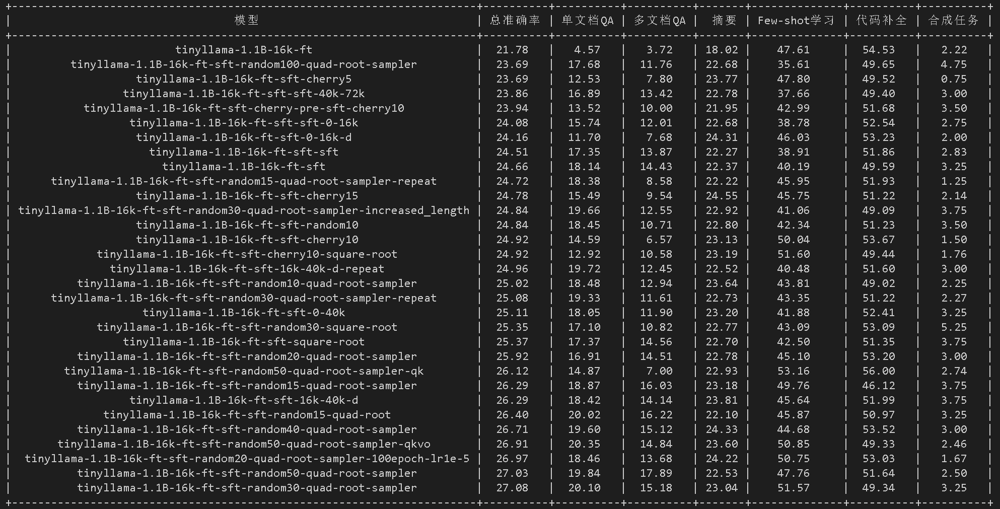
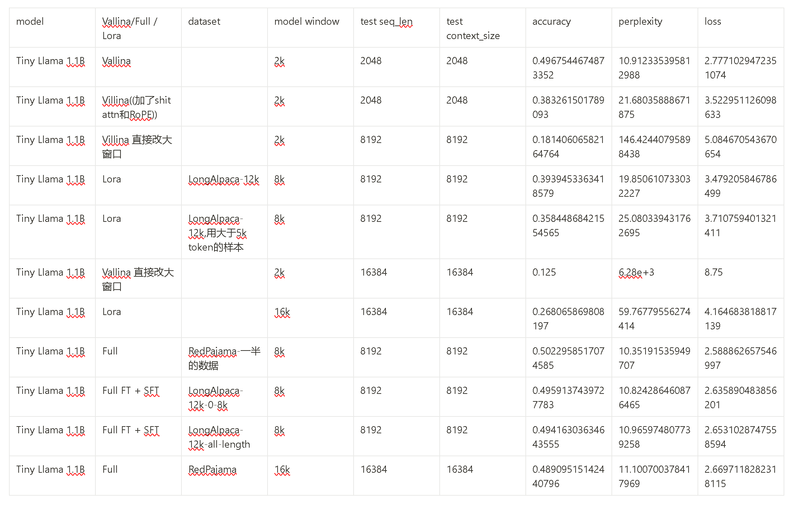

# Long Context Hub

This project is designed to extend large models to handle longer contexts. The following steps outline the process for setting up the project, downloading necessary datasets, and running fine-tuning and supervised fine-tuning tasks.

## 1. Clone the repository

```bash
git clone git@github.com:ZackZikaiXiao/long_context_hub.git
```

安装所需库:
```bash
pip install -r requirements.txt
pip install flash-attn --no-build-isolation
```

## 2. 下载continued pretrain数据集
To download the LongAlpaca-12k dataset from Hugging Face and place it in the project directory, run the following command:

```bash
wget https://huggingface.co/datasets/Yukang/LongAlpaca-12k/resolve/main/LongAlpaca-12k.json -P ./dataset/
```
目录是：./dataset/LongAlpaca-12k.json


## 4. 下载supervised finetune数据集
下载 [RedPajama 数据集](https://huggingface.co/datasets/togethercomputer/RedPajama-Data-1T-Sample/tree/main) 到项目根目录 `./RedPajama-Data-1T-Sample`


## 5.Fine-tune
先下载llama3-8B-Instruct:
```bash
pip install modelscope
python download_llama3.py
```
下载好之后，命令行会提示：

2024-05-27 23:42:01,567 - modelscope - INFO - Loading ast index from /home/zikaixiao/.cache/modelscope/ast_indexer

Meta-Llama-3-8B-Instruct在modelscope下，比如:/home/zikaixiao/.cache/modelscope/hub/LLM-Research/Meta-Llama-3-8B-Instruct

在项目根目录运行
```bash
./scripts/run_fine_tune.sh
```
参数参考：
```bash
MODEL_NAME_OR_PATH="./models/llama3-8B" # 官方权重，用chat版本
MODEL_MAX_LENGTH=32768
OUTPUT_DIR="./llama3_weights/llama3-8B-32k-ft" 
```


## 6. Supervised fine-tunne
```bash
./scripts/run_supervised_fine_tune.sh
```
参数参考：
```bash
MODEL_NAME_OR_PATH="./llama3_weights/llama3-8B-32k-ft"
MODEL_MAX_LENGTH=32768
FILTER_MODE="all"    # FILTER_MODE要从从filter_ranges的key中选择
OUTPUT_DIR="./llama3_weights/llama3-8B-32k-ft-sft"
``` 

保存的路径OUTPUT_DIR要根据FILTER_MODE修改，在llama3-8B-ft后面加上后缀，比如：
- llama3-8B-32k-ft-sft-sft-16k-40k代表先ft，再所有数据sft，再用16k-40k长度的数据来sft
- llama3-8B-32k-ft-sft-0-16k-d代表先ft，再用除了0-16k以外的长度的数据来sft

```bash
filter_ranges=(
    ["all"]="(0, float('inf'), False)"               # OUTPUT_DIR: modelName-windowLength-ft-sft
    ["0-16k"]="(0, 16000, False)"                    # OUTPUT_DIR: modelName-windowLengthft-ft-sft-sft-0-16k
    ["16k-40k"]="(16000, 40000, False)"              # OUTPUT_DIR: modelName-windowLengthft-ft-sft-sft-16k-40k
    ["40k-72k"]="(40000, 72000, False)"              # OUTPUT_DIR: modelName-windowLengthft-sft-sft-40k-72k
    ["not-0-16k"]="(0, 16000, True)"                 # OUTPUT_DIR: modelName-windowLengthft-ft-sft-0-16k-d
    ["not-16k-40k"]="(16000, 40000, True)"           # OUTPUT_DIR: modelName-windowLengthft-ft-sft-16k-40k-d
    ["not-40k-plus"]="(40000, float('inf'), True)"   # OUTPUT_DIR: modelName-windowLengthft-ft-sft-40k-plus
)
```

## TO-DO
1. 把llama3-8B通过先ft（dataset: RedPajama）拓展到32k，得到llama3-8B-32k-ft
2. 在llama3-8B-32k-ft基础上sft(Alpaca-12k所有样本)，得到llama3-8B-32k-ft-sft
3. 对llama3-8B-32k-ft-sft分别通过FILTER_MODE="0-16k", "16k-40k", "40k-72k"的sft，得到llama3-8B-32k-ft-sft-sft-0-16k, llama3-8B-32k-ft-sft-sft-16-40k, llama3-8B-32k-ft-sft-sft-40-72k
4. 在llama3-8B-32k-ft基础上，通过FILTER_MODE="not-0-16k", "not-16k-40k", "not-40k-plus"的sft，得到llama3-8B-32k-ft-sft-0-16k-d, llama3-8B-32k-ft-sft-16k-40k-d, llama3-8B-32k-ft-sft-40k-plus
5. evaluate，我需要换成[LEval](https://github.com/OpenLMLab/LEval), 因为[Longbench](https://github.com/THUDM/LongBench/)输入字符长度只有1-40k，预计在16k token以内，不够用
6. 试一试tinyllama在LEval的不同长度范围的性能
7. 尝试从短到长的sft方案（自步学习）
8. 用IDF data selection试试

## Tinyllama1.1B实验和结论
<!--  -->

